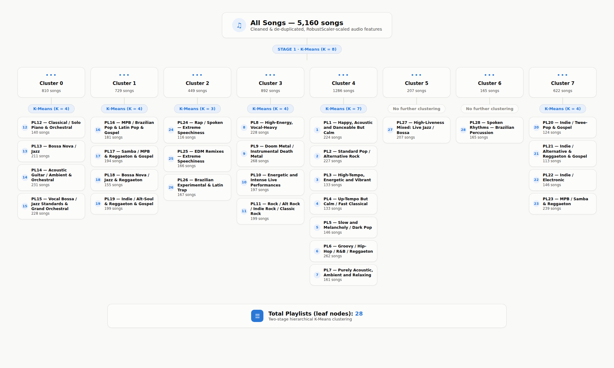
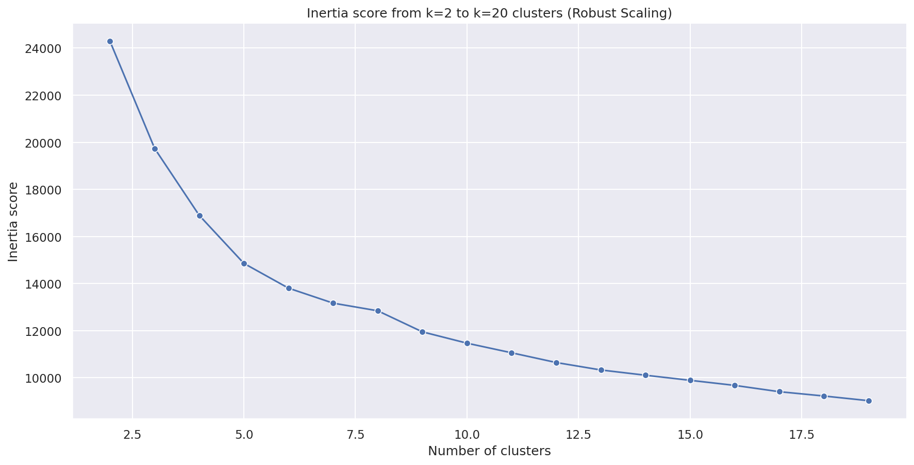
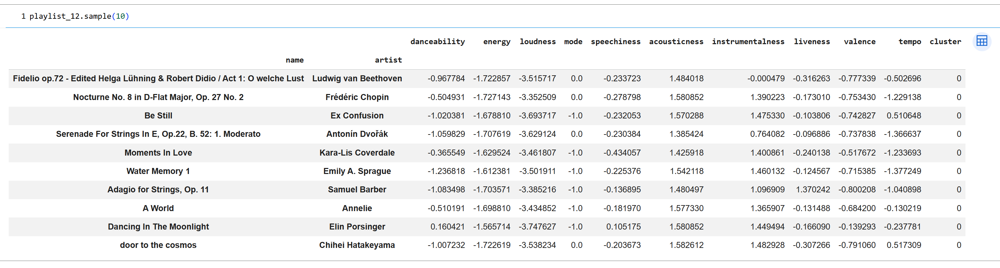

# Moosic Playlist Generation: Audio-Feature-Based Song Clustering with K-Means
 
## 🎯 Project Overview
 
Moosic needed to automate playlist creation as manual curation couldn't scale with business growth. Using K-Means clustering on Spotify's audio features, we grouped ~5,160 songs into 28 cohesive playlists (116–268 songs each) via a two-stage hierarchical approach — revealing both a natural genre-level structure and its limits, since audio features capture acoustic character well but often miss cultural/genre identity.

## 📊 Dataset & Sources
 
- **Source:** Spotify API audio features (provided as `spotify_5000_songs.csv`)
- **Size:** 5,235 songs × 18 columns raw; after removing duplicates and non-modeling columns, 5,160 unique songs × 10 audio features used for clustering.
- **Key Features Used:** `danceability`, `energy`, `loudness`, `mode`, `speechiness`, `acousticness`, `instrumentalness`, `liveness`, `valence`, `tempo`
- **Features dropped:** `type`, `duration_ms`, `key`, `time_signature`, `id`, `html` — these are identifiers, metadata, or fields (like `id`/`html`) that carry no musical/audio signal for clustering. `name` and `artist` are kept as the index for readability, not as model inputs.
- **Data Limitations & Preprocessing:**
  - Column names contained trailing whitespace, cleaned with `.str.strip()`
  - Exact duplicate rows were removed (5,235 → 5,160 songs).
  - No missing values were present in the 10 modeling features.
  - Features were scaled using `RobustScaler` rather than `StandardScaler`, since several features (`loudness`, `speechiness`, `instrumentalness`, `liveness`) showed strong skew and outliers that would have distorted mean/std-based scaling

## 🚀 Key Findings & Results
 
- **Two-stage clustering was necessary to satisfy business constraints.** A single flat K-Means pass with a elbow value (**k=8**) produced technically sound clusters, but they ranged from ~165 to ~1,286 songs each — far too large to work as a playlist. Re-clustering each broad group individually produced **28 final playlists sized ~113–268 songs**, matching Moosic's usable playlist size range.
- **The clusters read as musically coherent genres, not noise.** Playlist 12 (drawn from the "Classical" branch) surfaces Beethoven, Chopin, Dvořák, and Barber; Playlist 9 is dominated by doom/death metal tracks. Distinct, high-signature genres like classical and metal are separated cleanly by audio features alone.
- **Audio features only partially substitute for human musical judgment.** They work well for genres with strong, consistent acoustic signatures (metal, classical) but blur together for genres distinguished mainly by language, lyrical content, or cultural context.
- **The mathematically "best" k and the business-usable k are different numbers.** The elbow method suggests a broad structure around k=8, but Moosic needs on the order of 20–30 playlists to hit its target playlist size — hence the two-stage hierarchical design.
- **28 playlists were mapped to 10 dominant-genre groups** for the team's review (Pop, Rock, Metal, EDM, Classical, Jazz, Hip-Hop/Rap/R&B, Latin, Indie Pop, Ambient/Acoustic) — see the picture below in Visualizations.

## 🛠️ Technologies Used
 
- **Programming:** Python
- **Libraries:** pandas,scikit-learn, seaborn.
- **Machine Learning:** K-Means clustering (two-stage / hierarchical application), `RobustScaler`, elbow method (inertia) and silhouette score for choosing k
- **Environment:** Google Colab

## 📁 Project Structure
 
```
moosic-playlist-clustering/
├── README.md                          # This file
├── data/
│   ├── spotify_5000_songs.csv         # Raw dataset (Spotify audio features, ~5,235 songs)
│   └── final_playlist_sizes.csv       # Recomputed size of each of the 28 final playlists
├── notebooks/
│   └── moosic_analysis.ipynb          # Main analysis notebook (cleaning, scaling, two-stage K-Means, playlist labeling)
└── images/
    ├── 00_hierarchy_overview.png      # Full two-stage clustering tree: all 8 broad clusters -> all 28 final playlists
    ├── 01_elbow_full_dataset.png      # Stage 1 elbow plot (full dataset, k=2-19)
    └── 02_playlist12_sample.png       # Sample of 10 tracks from Playlist 12 (Classical / Solo Piano & Orchestral)
```
 
## 📈 Visualisations
 

*The full pipeline in one picture: Stage 1 splits all 5,160 songs into 8 broad K-Means clusters; Stage 2 re-clusters each broad group individually (or leaves it untouched when it's already playlist-sized) to produce the final 28 playlists, each labeled by its dominant audio-feature profile.*
 

*Inertia vs. number of clusters on the full, robust-scaled dataset. The curve bends around k=8 and  k=8 was chosen as the Stage 1 broad grouping to balance model simplicity with capturing distinct musical regions.*
 

*A random sample of 10 tracks from Playlist 12 ("Classical / Solo Piano & Orchestral," 140 songs). Beethoven, Chopin, Dvořák, and Barber all land in the same cluster, and every sampled track shares the same acoustic signature: low energy, low danceability, very high acousticness — concrete evidence the prototype produces musically cohesive playlists.*

 ## 🔗 How to Use This Project
 
1. **Main Analysis:** Open [`notebooks/moosic_analysis.ipynb`](notebooks/moosic_analysis.ipynb) (or the original Colab notebook) to see the full workflow: cleaning → scaling → Stage 1 clustering (k=8) → Stage 2 re-clustering per broad group → 28 labeled playlists.
2. **Data:** The dataset is included at `data/spotify_5000_songs.csv`.
3. **Run the Code:** Open the notebook in Google Colab or Jupyter and run all cells top to bottom.
4. **Dependencies:** `pandas`, `numpy`, `scikit-learn`, `seaborn`, `matplotlib`. No special setup is required beyond a standard Python data-science environment.

## 💬 Discussion : Answering the Team's Core Questions
 
**Are Spotify's audio features capable of identifying "similar songs" the way humans would?**
Partially. They work well for genres with a strong, consistent acoustic signature — metal and classical music cluster cleanly and consistently. But since the features carry no information about lyrics, language, or cultural context, genres that humans distinguish primarily by those cues (e.g. Brazilian MPB vs. reggaeton vs. gospel) often blur together in the same cluster. Data that could help going forward: lyric/topic embeddings, language detection, listener co-occurrence or skip/like behavior, and genre or mood tags from other sources.
 
**Is K-Means a good method for creating playlists?**
 
*Pros*
- Simple, fast, and easy to explain to a non-technical team.
- Works very well on genres with an extreme, distinct audio signature (metal, classical).

*Cons*
- The mathematically "best" k (via elbow/silhouette) doesn't match the business need — Moosic needs 20-30 similarly-sized playlists, not the 6-9 a pure elbow analysis would suggest, which is why a two-stage hierarchical approach was needed.
- K-Means assumes round, similarly-sized clusters and requires manually re-running/re-splitting oversized groups; it doesn't natively produce evenly-sized clusters or handle non-spherical genre boundaries.
- Cluster "meaning" still needs a human to listen and label — the algorithm finds structure, but the playlist name/story is added afterward.


